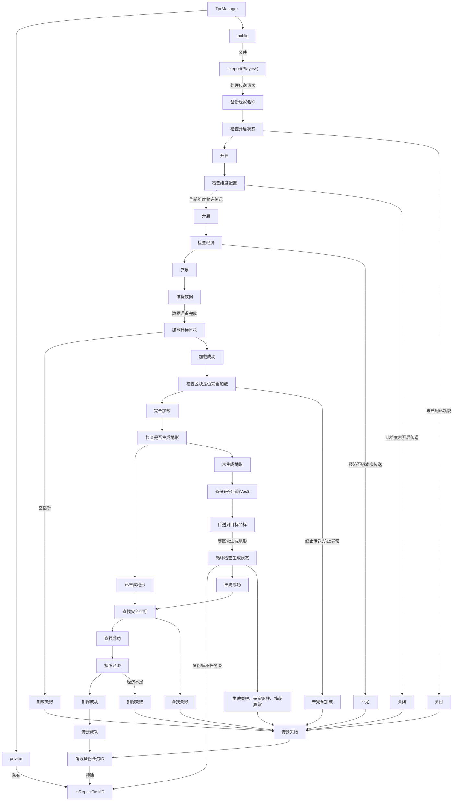

```mermaid
graph TD

A["TprManager"]
B["private"]
C["public"]
E["mRepectTaskID"]

A --> B
A --> C
B --> |私有| E

C --> |公共| F["teleport(Player&)"]
F --> |处理传送请求| G["备份玩家名称"]
G --> H["检查开启状态"]
H --> I["开启"]
H --> |未启用此功能| J["关闭"]
J --> Z["传送失败"]
I --> K["检查维度配置"]
K --> |当前维度允许传送| L["开启"]
K --> |此维度未开启传送| M["关闭"]
M --> Z

L --> N["检查经济"]
N --> O["充足"]
N --> |经济不够本次传送| P["不足"]
P --> Z

O --> Q["准备数据"]
Q --> |数据准备完成| R["加载目标区块"]
R --> |空指针| S["加载失败"]
R --> T["加载成功"]

S --> Z
T --> U["检查区块是否完全加载"]
U --> V["完全加载"]
U --> |终止传送,防止异常| W["未完全加载"]

W --> Z

V --> X["检查是否生成地形"]
X --> Y["已生成地形"]
X --> A1["未生成地形"]

Y --> A2["查找安全坐标"]

A2 --> A5["查找成功"]
A2 --> A6["查找失败"]
A6 --> Z
A5 --> A7["扣除经济"]
A7 --> A8["扣除成功"]
A7 --> |经济不足| A9["扣除失败"]
A9 --> Z

A8 --> A10["传送成功"]

A10 --> B1["销毁备份任务ID"]
B1 --> |擦除| E
Z --> B1

A1 --> A3["备份玩家当前Vec3"]
A3 --> A4["传送到目标坐标"]

A4 --> |等区块生成地形| C1["循环检查生成状态"]
C1 --> |备份循环任务ID| E

C1 --> C3["生成成功"]
C1 --> C4["生成失败、玩家离线、捕获异常"]
C4 --> Z
C3 --> A2


```
