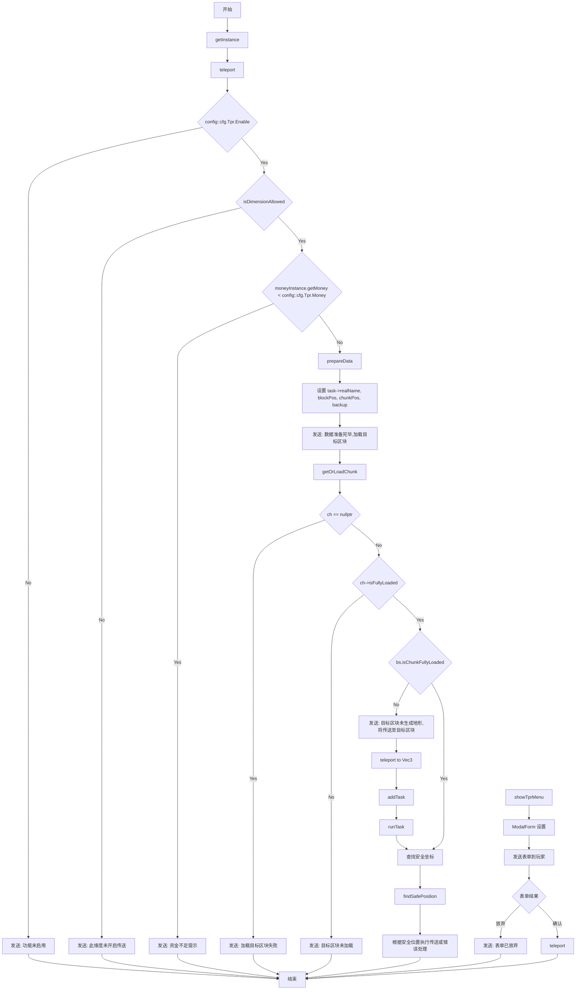

```mermaid
flowchart TD
    A[开始] --> B[getInstance]
    B --> C[teleport]
    C --> D{config::cfg.Tpr.Enable}
    D -- No --> E[发送: 功能未启用]
    E --> Z[结束]
    D -- Yes --> F{isDimensionAllowed}
    F -- No --> G[发送: 此维度未开启传送]
    G --> Z
    F -- Yes --> H{moneyInstance.getMoney < config::cfg.Tpr.Money}
    H -- Yes --> I[发送: 资金不足提示]
    I --> Z
    H -- No --> J[prepareData]
    J --> K[设置 task->realName, blockPos, chunkPos, backup]
    K --> L[发送: 数据准备完毕,加载目标区块]
    L --> M[getOrLoadChunk]
    M --> N{ch == nullptr}
    N -- Yes --> O[发送: 加载目标区块失败]
    O --> Z
    N -- No --> P{ch->isFullyLoaded}
    P -- No --> Q[发送: 目标区块未加载]
    Q --> Z
    P -- Yes --> R{bs.isChunkFullyLoaded}
    R -- No --> S[发送: 目标区块未生成地形,将传送至目标区块]
    S --> T[teleport to Vec3]
    T --> U[addTask]
    U --> V[runTask]
    V --> W[查找安全坐标]
    W --> X[findSafePosition]
    X --> Y[根据安全位置执行传送或错误处理]
    Y --> Z
    R -- Yes --> W

    showTprMenu --> AA[ModalForm 设置]
    AA --> AB[发送表单到玩家]
    AB --> AC{表单结果}
    AC -- 放弃 --> AD[发送: 表单已放弃]
    AD --> Z
    AC -- 确认 --> AE[teleport]
    AE --> Z
```
